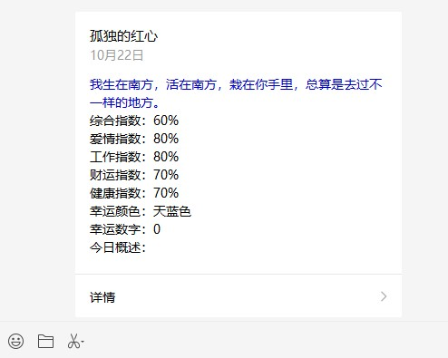
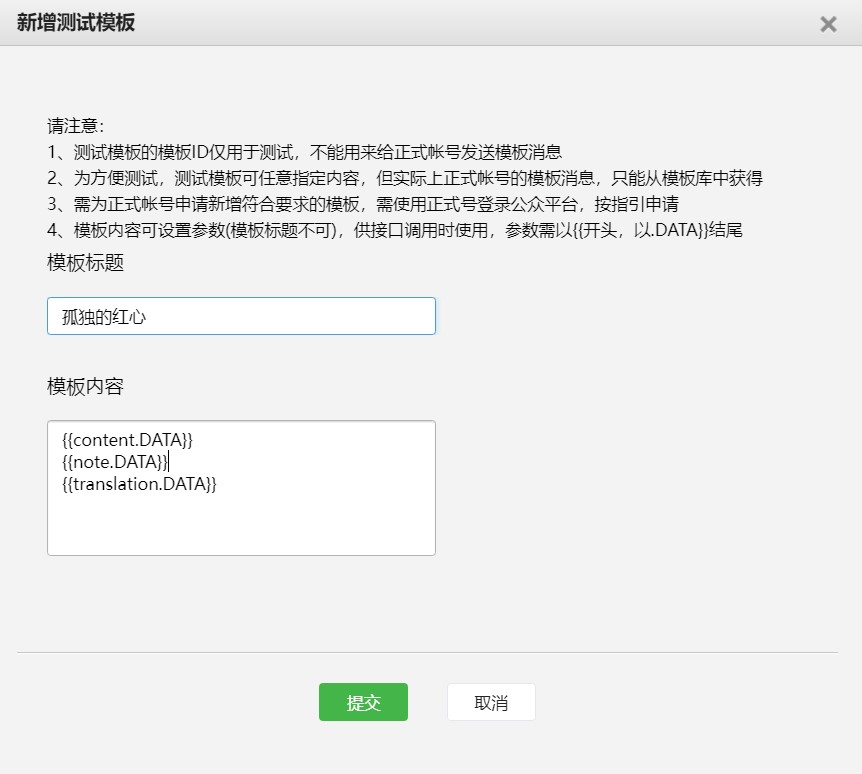
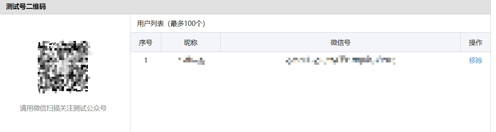
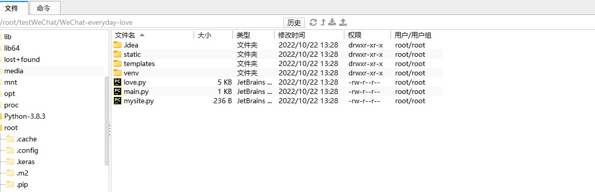
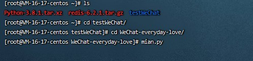
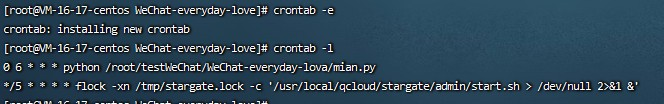
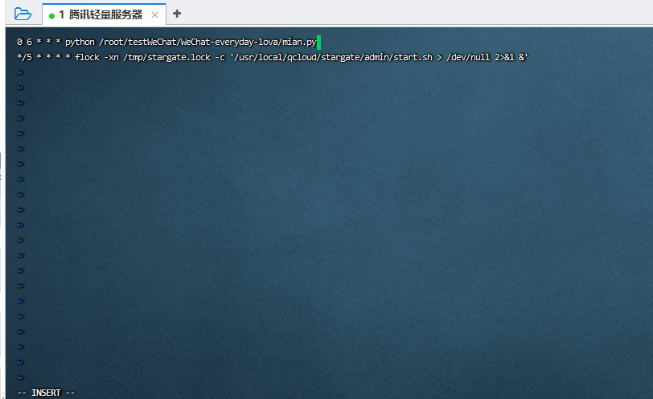

这个是我参考github上一个大佬做的，微信开发已经活跃了很长时间了，在微信开发中有一个神奇的接口它叫**模板消息接口**，它可以根据用户的openid从服务端给用户推送自定义的模板消息，正因如此，我们可以利用这个特征在服务器端随时向用户推送消息（前提是该用户关注了该公众号）。大佬做的是微信公众号上每天发送一个模板信息，在他所做的内容基础上，我添加了新的API和python的flask生成一个页面显示，先上图。



点击详情，还可以显示一个表达爱意的前端特效。


接下来看看具体如何实现吧。

# 一、准备工作


首先登录[微信公众平台](https://mp.weixin.qq.com/debug/cgi-bin/sandbox?t=sandbox/login)。然后微信授权登录。这里主要需要获取三个东西。

- 测试的appId
- 测试的appsecret

- 模板ID

填写模板



这里我设置的是  
````
{{content.DATA}}
综合指数：{{total.DATA}}
爱情指数：{{love.DATA}}
工作指数：{{work.DATA}}
财运指数：{{money.DATA}}
健康指数：{{health.DATA}}
幸运颜色：{{color.DATA}}
幸运数字：{{math.DATA}}
今日概述：{{toady.DATA}}
````
这个需要根据你的需求和请求API返回的json数据填写。

接着需要准备的是API请求，我使用的天行数据API，每天可以免费请求一定次数的API，对于个人学习测试来说是足够的。

# 二、实现发送微信模板消息的程序
## 主程序
将准备阶段获得的appId、appsecret、template_id传入，并获取用户列表，这个用户列表指的是关注你的测试号的微信用户，可通过扫码添加（一定要让你的那个她扫码关注哦）。



````
# coding=utf-8
import love
if __name__ == '__main__':
    # 微信配置
    wechat_config = {
        'appid': '',  # (No.1)此处填写公众号的appid
        'appsecret': '',  # (No.2)此处填写公众号的appsecret
        'template_id': ''  # (No.3)此处填写公众号的模板消息ID
    }

    # 用户列表
    '''
        run()方法可以传入openids列表，也可不传参数
        不传参数则对微信公众号的所有用户进行群发
    '''
    openids = [
        '',  # (No.4)此处填写你的微信号（微信公众平台上的微信号）
        # 'xxxxx', #如果有多个用户也可以
        # 'xxxxx',
    ]

    # 执行
    icb = love.love(wechat_config)

    icb.run()
````
## 函数实现
执行流程如下图

.png)

### 获取认证
````
# 获取access_token
def get_access_token(self, appid, appsecret):
    url = 'https://api.weixin.qq.com/cgi-bin/token?grant_type=client_credential&appid=%s&secret=%s' % (appid, appsecret)
    r = requests.get(url)
    data = json.loads(r.text)
    if 'errcode' in data:
        self.print_log(data)
    else:
        self.access_token = data['access_token']
````
### 获取用户列表
````
# 获取用户列表
def get_user_list(self):
    if self.access_token == '':
        self.get_access_token(self.appid, self.appsecret)
    url = 'https://api.weixin.qq.com/cgi-bin/user/get?access_token=%s&next_openid=' % self.access_token
    r = requests.get(url)
    data = json.loads(r.text)
    if 'errcode' in data:
        self.print_log(data)
    else:
        openids = data['data']['openid']
        return openids
````
### 发送消息
````
# 发送消息
def send_msg(self, openid, template_id, iciba_everyday,astro_words):
    msg = {
        'touser': openid,
        'template_id': template_id,
        'url': '81.70.161.239',  # 设置跳转页面
        'data': {
            'content': {
                'value': iciba_everyday['newslist'][0]['content'],
                'color': '#0000CD'
                },
            'total': {
                'value': astro_words['newslist'][0]['content'],
            },
            'love': {
                'value': astro_words['newslist'][1]['content'],
            },
            'work': {
                'value': astro_words['newslist'][2]['content'],
            },
            'money': {
                'value': astro_words['newslist'][3]['content'],
            },
            'health': {
                'value': astro_words['newslist'][4]['content'],
            },
            'color': {
                'value': astro_words['newslist'][5]['content'],
            },
            'math': {
                'value': astro_words['newslist'][6]['content'],
            },
            'today': {
                'value': astro_words['newslist'][8]['content'],
            },
            'note': {
                'value': '离上岸又近一步，加油！！！',
            }

        }
    }
    json_data = json.dumps(msg)
    if self.access_token == '':
        self.get_access_token(self.appid, self.appsecret)
    url = 'https://api.weixin.qq.com/cgi-bin/message/template/send?access_token=%s' % self.access_token
    r = requests.post(url, json_data)
    return json.loads(r.text)
````
### 请求API
````
# 获取渣男语录每天一句
def get_iciba_everyday(self):
    url = ''   # 请求API  按照请求格式
    r = requests.get(url)
    return json.loads(r.text)
def get_astro(self):
    url = ''  # 请求API  按照请求格式
    r = requests.get(url)
    return json.loads(r.text)
````
### 调用send_msg给用户发送信息
````
# 为设置的用户列表发送消息
def send_everyday_words(self, openids):
    everyday_words = self.get_iciba_everyday()
    astro_words = self.get_astro()
    print(astro_words['newslist'][8]['content'])
    for openid in openids:
        openid = openid.strip()
        result = self.send_msg(openid, self.template_id, everyday_words,astro_words)
        self.print_log(result, openid)
````
### 执行
````
# 执行
def run(self, openids=[]):
    if openids == []:
        # 如果openids为空，则遍历用户列表
        openids = self.get_user_list()
    # 根据openids对用户进行群发
    self.send_everyday_words(openids)
````
最后执行主函数，它就可以收到消息了。

### flask web框架
使用flask实现一个简单的前端页面服务，这样点击模板消息就可以跳转你想展示得页面。
````
from flask import Flask, request, render_template
import os

app = Flask(__name__)

@app.route('/', methods=['GET', 'POST'])
def home():
    return render_template('randomCall.html')

if __name__ == '__main__':
    app.run()
````
# 三、部署云服器
实验环境
- 云服务器
- python 3.x以上

将项目文件上传到云服务器目录


运行程序



在云服务器上可以通过crontab命令设置定时任务  
`crontab -e`  
添加如下内容  
````0 6 * * *    python /root/testWeChat/WeChat-everyday-lova/mian.py````  
以上内容的含义是，在每天`6:00`的时候，执行这个Python程序  
通过`crontab -l`可以查看是否设置成功



 

至此项目就大功告成了，祝各位1024快乐！
